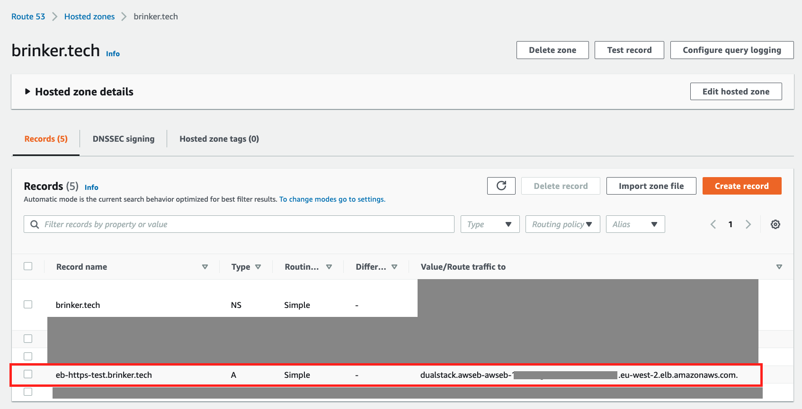

# Elastic Beanstalk - Hardened Security Deployment (CDK v2)
**Repo name:** aws-elastic-beanstalk-hardened-security-cdk-sample

**Tagline:** This is an open-source sample of a CDK script which deploys an AWS Elastic Beanstalk application with a hardened security configuration, it accompanies this blogpost: https://aws.amazon.com/blogs/security/hardening-the-security-of-your-aws-elastic-beanstalk-application-the-well-architected-way/

## Purpose of sample
In [our aws blogpost](https://aws.amazon.com/blogs/security/hardening-the-security-of-your-aws-elastic-beanstalk-application-the-well-architected-way/), we describe how our customers can harden their Elastic Beanstalk applications according to the Well-Architected Framework. This sample provides a way to explore how one could approach deploying some of the configurations mentioned in the post as Infrastructure as Code (IaC) using the AWS CDK.

## DISCLAIMER:
The sample code; software libraries; command line tools; proofs of concept; templates; or other related technology (including any of the foregoing that are provided by our personnel) is provided to you as AWS Content under the AWS Customer Agreement, or the relevant written agreement between you and AWS (whichever applies). You should not use this AWS Content in your production accounts, or on production or other critical data. You are responsible for testing, securing, and optimizing the AWS Content, such as sample code, as appropriate for production grade use based on your specific quality control practices and standards. Deploying AWS Content may incur AWS charges for creating or using AWS chargeable resources, such as running Amazon EC2 instances or using Amazon S3 storage.

## About this sample
This sample, shows how to deploy the AWS Elastic Beanstalk environment using the new CDK v2. More specifically, the core of the CDK script deploys the following resources:
1. An Elasic Beanstalk sample NodeJS application which collects data about hikes and stores it in a database:
    1. Two-tier web application deployed in a custom VPC
    2. ALB Deployed in Public Subnets
    3. Web-servers running on Amazon EC2 deployed in an Auto Scaling group in private subnets (NAT access)
    4. Database deployed in isolated subnets (no NAT access)
2. Web Servers which use **IAM authentication** (rather than static credentials) to connect to the RDS database
3. An **encrypted Amazon RDS database**, with a Multi-AZ stand-by replica, IAM authentication, and automated backups
4. HTTPS connectivity for clients
5. Automatically generated DB admin credentials using AWS Secrets Manager
6. A Lambda function which runs a SQL query to automatically initialise the Database with a user for IAM authentication
7. **Encrypted Amazon S3 bucket** for deployments and log storage
8. Elastic Beanstalk [Managed Updates](https://docs.aws.amazon.com/elasticbeanstalk/latest/dg/environment-platform-update-managed.html) settings enabled

## Architecture Diagram

## Table of contents
  - [Running the CDK script](#running-the-cdk-script)
  - [Core Project Resources](#core-project-resources)
  - [Important notes](#important-notes)
  - [Setting up HTTPS](#setting-up-https)
    - [Summary](#summary)
    - [Requesting a public certificate](#requesting-a-public-certificate)
    - [Associating your custom domain with your application's load balancer](#associating-your-custom-domain-with-your-applications-load-balancer)
  - [Project outputs](#project-outputs)
  - [Configuration Settings](#configuration-settings)
    - [Application Settings](#application-settings)
    - [Database Settings](#database-settings)
  - [Cleaning up](#cleaning-up)
  - [Reference resources used for script](#reference-resources-used-for-script)
  - [Security](#security)
  - [License](#license)
## Running the CDK script
**Important**: Creating the AWS Lambda function to initialise the database uses Docker, please ensure you've got Docker running on your machine before deploying the script.

1. Clone this repository
2. Run `npm install` to install the dependencies specified in `package.json` file
3. Make sure you've got AWS credentials, and CDK version 2 installed (`npm install -g aws-cdk`)
4. Verify you're running CDK version 2.1.0 or higher by running `cdk --version`
5. Bootstrap the CDK environment by running `cdk bootstrap`
6. **!! Important !!** we recommend encrypting data in transit, and our script's default configuration in `cdk.json` requires some information in order to set this up - see [Setting up HTTPS](#setting-up-https) for more information. If you do not wish to use the secure HTTPS protocol, e.g. for testing purposes, you need to explicitly disable the `lbHTTPSEnabled` setting in `cdk.json` before the script can be run.
7. Adjust any other setting you like in the `cdk.json` file
8. Run the CDK script using `cdk deploy`, confirm the IAM changes that will be made
9. Sit back, and watch the CDK script get deployed. The Amazon RDS instance deployment can take some time, because it is encrypted with backups enabled, so make yourself a cup of tea. Check [Important notes](#important-notes) if you encounter an error.
10. After the deployment has finished, you should see the following output. It shows the output of the SQL query which was run to insert a USER into the DB for authentication (rather than using admin credentials):

## Core Project Resources
1. `cdk.json` file, which contains the configuration settings used throughout the project
2. `lib` folder, which contains the code used for CDK Deployment
    1. `elastic_beanstalk_cdk_project-stack.ts`: Main Stack, contains the code to deploy most resources, including:
        - Encrypted S3 bucket
        - Custom VPC
        - Roles and Policies required to run the application
        - Security Groups
        - Elastic Beanstalk application
    2. `rds_infrastructure.ts`: CDK Construct for the database
        - Creates the RDS database with configuration settings defined in `cdk.json`.
        - Contains a CDK Custom Resource which is required to add the appropriate policy to the web server IAM role to be able to allow it to use IAM authentication to connect to the database
    3. `rds_initialiser.ts`: CDK Construct which creates a custom AWS Lambda function (see next point)
2. `lib/rds-init-fn-code` folder: Source code for custom Lambda function
    -  Source code for lambda function which runs a SQL statement against the RDS database to initialise it with a USER which we can use for IAM Authentication for the web servers.
3. `src/deployment_zip` folder: Contains the  `nodejs.zip` file which is used to run the sample application on Elastic Beanstalk
4. `src/code` folder: Contains the source code which is included in the `nodejs.zip` file
    - `app.js` contains the code which runs an express server, and connects to the RDS database using IAM authentication.

## Important notes
- If you get an error regarding the Solution Stack name, ensure to set the latest version from [here](https://docs.aws.amazon.com/elasticbeanstalk/latest/platforms/platforms-supported.html#platforms-supported.nodejs) in `cdk.json` under `solutionStackName`.
- HTTPS connectivity with Load Balancer (default) has some pre-requisite settings (see next section in this readme). Deployment will fail without those pre-requisites. We recommend using encryption wherever possible, however if you want to run this sample with HTTP instead of HTTPS, e.g. to test out the application, disable the HTTPS setting in the `cdk.json` file.
- If your deployment fails, depending on which step you managed to get to, you might have to manually delete the S3 bucket created by Cloudformation before you can run it again.
- Elastic Beanstalk creates two EC2 Security groups: As described in [this issue](https://github.com/aws/elastic-beanstalk-roadmap/issues/44), Elastic Beanstalk currently creates a default security group for the EC2 instances on top of the custom one we create in this script. In terms of ingress/egress, the default security group is the same as the security group we create ourselves (which we need to do to allow access from EC2 instances to RDS database), unfortunately we can't (easily) disable creating this default security group as part of the setup script.
- Sample Express application is for demo purposes only: We've taken the Express NodeJS example from the [AWS Elastic Beanstalk Developer Guide](https://docs.aws.amazon.com/elasticbeanstalk/latest/dg/nodejs-getstarted.html) as an easy way to create an application that connects to an RDS database. We cannot guarantee that the source code adheres to recommended best practices when it comes to web development. We recommend that you only use it for inspiration for your own application, in particular, to connect to an RDS database using IAM authentication. Similarly, it is your responsibility to adhere to your (organisation's) policy regarding data storage, PII, etc.
- CDK / Cloudformation might not pick up some changes in the Elastic Beanstalk Settings (L298 in `lib/elastic_beanstalk_cdk_project-stack.ts`) so it might require a redeployment of the setup.
- If you get a 'fatal' error when testing the application, it could be because MySQL might have terminated the connection if it has not been actively used for a couple of hours (more info, see [here](https://aws.amazon.com/blogs/database/best-practices-for-configuring-parameters-for-amazon-rds-for-mysql-part-3-parameters-related-to-security-operational-manageability-and-connectivity-timeout/)). Because this is a sample application, it does not handle re-creating the database connection. For demo purposes, you can restart the application through the Elastic Beanstalk console to create a new DB connection.

## Setting up HTTPS
### Summary
In order to setup HTTPS as part of this example, you will need the following three items:
1. A custom domain (Amazon Route53 or 3rd-party)
2. A certificate for your custom domain in Amazon Certificate Manager to associate with your Elastic Load Balancer.
3. A Hosted Zone in Route53 to route traffic to your custom domain to the Load Balancer associated with your Elastic Beanstalk application.

### Requesting a public certificate
For public facing web applications, you can request a free certificate in AWS Certificate Manager for a custom domain you own. Verification can be done via DNS or Email. For more information on how to request a certificate see [here](https://docs.aws.amazon.com/acm/latest/userguide/gs-acm-request-public.html).

Once you have created a certificate, you should be able to see it in the overview (once it has been associated with a resource, it will also be indicated):

### Associating your custom domain with your application's load balancer
In order to have HTTPS connectivity between your clients and your load balancer, you need to create an Alias record for your custom domain to your Load Balancer. You can do this using Amazon Route 53's Hosted Zones. In order to setup a Hosted Zone, see this [documentation](https://docs.aws.amazon.com/Route53/latest/DeveloperGuide/CreatingHostedZone.html).

After you've created the hosted zone, add an Alias record and point it to the Load Balancer which is created as part of the Elastic Beanstalk application through this CDK script.

And you should see the entry in your Hosted Zone:

**Note**: it can take a couple of minutes before the DNS Record for your custom domain is fully propagated and resolving to your application.

## Project outputs
1. If you've setup HTTPS, go to the link of your custom domain

2. Otherwise, go to your Elastic Beanstalk environment in the console, and find the newly created application

3. If you're not using HTTPS (e.g. for testing purposes), go to the link at the top of the page to visit the application

4. Go to the /hikes page, here you can add entries and verify the database is successfully connected

5. Check-out the `pictures` folder of this repository for more images of the deployment:
    - Policy attached to web instance role which allows IAM authentication to the DB
    - Overview of the DB settings
    - Enhanced Health overview
    - Overview of environment variables for the application
    - Log storage
    - Configuration of the Managed Updates

## Configuration Settings
In the `cdk.json` file, under the "configuration" section, you can adjust configuration parameters which the CDK script will use for deployment. For Elastic Beanstalk specific settings, configurations have been taken from [General options for all environments
](https://docs.aws.amazon.com/elasticbeanstalk/latest/dg/command-options-general.html):

### Application Settings
* **"instanceType"**: Specify Instance type of Web Instances - e.g. "t2.micro",
* **"applicationName"**: Specify the name for your Application - e.g. "MySimpleNodejsExample",
* **"vpcName"**: Specify the name for the VPC - e.g. "MyVPC",
* **"vpcCidr"**: Define the CIDR for your VPC - e.g. "10.0.0.0/16",
* **"loadbalancerInboundCIDR"**: Define the inbound IP address CIDR the load balancer security group, default is "0.0.0.0/0" to allow all connections, adjust to restrict inbound traffic from specific IP addresses.
* **"loadbalancerOutboundCIDR"**: Define the outbound IP address CIDR for load balancer security group, default is "0.0.0.0/0" to allow all connections, adjust to restrict outbound traffic to specific IP addresses.
* **"webserverOutboundCIDR"**: Define the outbound IP address CIDR for the webserver security group, default is "0.0.0.0/0" to allow all connections, adjust to restrict outbound traffic to specific IP addresses.
* **"zipFileName"**: Define the name of the ZIP file for deployment in the `src/deployment_zip` folder. E.g. - "nodejs.zip",
* **"solutionStackName"**: Use the solution stack name so that Elastic Beanstalk can automatically deploy with a software stack running on the EC2 instances. E.g. - "64bit Amazon Linux 2 v5.5.0 running Node.js 14". More information and solution stack names can be found [here](https://docs.aws.amazon.com/elasticbeanstalk/latest/dg/concepts.platforms.html).
* **"managedActionsEnabled"**: Boolean string, with managed platform updates you can configure Elastic Beanstalk to automatically upgrade to the latest patch / platform version. E.g. - "true",
* **"updateLevel"**: Highest level of update to apply with managed actions. E.g - "patch", more info [here](https://docs.aws.amazon.com/elasticbeanstalk/latest/dg/command-options-general.html).
* **"preferredUpdateStartTime"**: Maintenance window for managed actions in "day:hour:minute" format. E.g. - "Sun:01:00",
* **"streamLogs"**: Specifies whether to create groups in Amazon CloudWatch Logs for proxy and deployment logs, and stream logs from each instance in your environment. E.g. "true",
* **"deleteLogsOnTerminate"**: Whether or not to delete logs after environment is terminated. E.g. - "false",
* **"logRetentionDays"**: Defines number of days logs should be retained, if not automatically deleted on termination. E.g. - "7",
* **"loadBalancerType"**: Specifies Load Balancer type - e.g. "application",
* **"lbHTTPSEnabled"**: Boolean, specifies whether or not to use HTTPS for the connection between clients and Load Balancer.
* **"lbHTTPSCertificateArn"**: If using HTTPS, a valid ARN for a certificate in AWS Certificate Manager needs to be provided.
* **"lbSSLPolicy"**: Specifies which policy to use for the TLS listener. Default is "ELBSecurityPolicy-FS-1-2-Res-2020-10", for more options, see [here](https://docs.aws.amazon.com/elasticloadbalancing/latest/application/create-https-listener.html)). For your production applications, choose a policy which fits your security requirements.

### Database Settings
* **"dbName"**: RDS Database name, e.g. - "databasename",
* **"dbAdminUsername"**: Admin username for database, e.g. - "admin",
* **"dbWebUsername"**: Username for database initialisation (SQL statement) used by the web servers to connect to database. E.g. - "dbwebuser",
* **"dbStorageGB"**: Storage size in GB for database - e.g. 100,
* **"dbMaxStorageGiB"**: Maximum size for database in GiB - e.g. 200,
* **"dbMultiAZ"**: Boolean, select if you want to deploy DB in a multi-AZ configuration for disaster recovery. E.g. - true,
* **"dbBackupRetentionDays"**: The number of days during which automatic DB snapshots are retained. E.g. 7,
* **"dbDeleteAutomatedBackups"**: Set if automated backups should be deleted when you delete the DB instance. E.g. - true,
* **"dbPreferredBackupWindow"**: Daily time-range for automated backups in "hh24:mi-hh24:mi" format. E.g. - "01:00-01:30",
* **"dbCloudwatchLogsExports"**: Determine which logs are exported to CloudWatch depends on DB type. For MySQL see [this link](https://docs.aws.amazon.com/AmazonRDS/latest/UserGuide/USER_LogAccess.MySQL.LogFileSize.html). E.g. - ["audit","error","general","slowquery"],
* **"dbIamAuthentication"**: Whether or not to use IAM authentication for the WebInstances to connect to the database (rather than static passwords).e.g. - true,
* **"dbInstanceType"**: Set the instance type for the Database Instance. E.g. - "t2.small",
* **"dbRetentionPolicy"**: Set the deletion policy for the database. Values: "retain", "destroy", and "snapshot". If the stack is deleted, and deletion policy is set to "retain", then the database will not be deleted, including relevant networking infrastructure (such as VPC, Security Groups, etc.). Default value for demo: "destroy"

## Cleaning up
To delete the resources created as part of this script, run `cdk destroy`. Depending on your 'dbRetentionPolicy' setting, some resources might be retained after deletion. This would be the RDS instance including networking infrastructure related to the database (i.e. VPC, Subnets, Security Groups, etc.). On top of that, the Elastic Beanstalk S3 bucket is not automatically deleted, regardless of deletion policy, and you will have to empty it first, remove Deletion Protection in the S3 permissions, and then delete the bucket.

## Reference resources used for script
Note: below, some links refer to Issues which contain explanations or code-examples for some of the work-arounds. More details can be found in the specific source code files of this project, which refer to these links where applicable.

Resources used:
1. General AWS Public Documentation
2. https://docs.aws.amazon.com/elasticbeanstalk/latest/dg/command-options-general.html
3. https://issueexplorer.com/issue/aws/aws-cdk/17205
4. https://github.com/aws/aws-cdk/issues/1430
5. https://aws.amazon.com/blogs/infrastructure-and-automation/use-aws-cdk-to-initialize-amazon-rds-instances/
6. https://docs.aws.amazon.com/elasticbeanstalk/latest/dg/nodejs-getstarted.html
7. https://github.com/aws/aws-cdk/issues/11851
8. https://github.com/aws/aws-sdk-js-v3/issues/1823

## Security

See [CONTRIBUTING](CONTRIBUTING.md#security-issue-notifications) for more information.

## License

This library is licensed under the MIT-0 License. See the LICENSE file.

